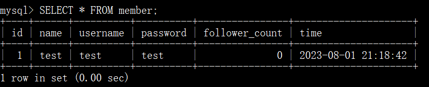
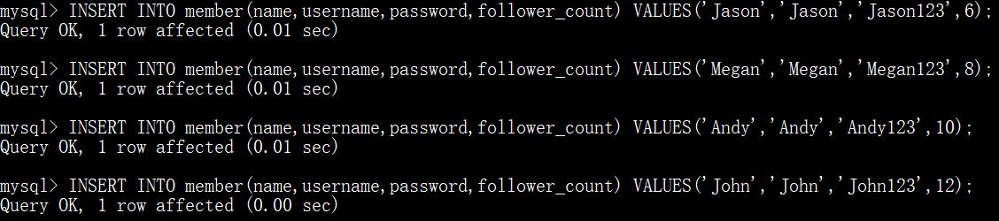
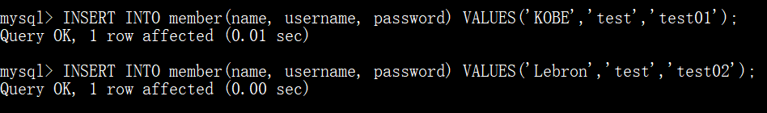
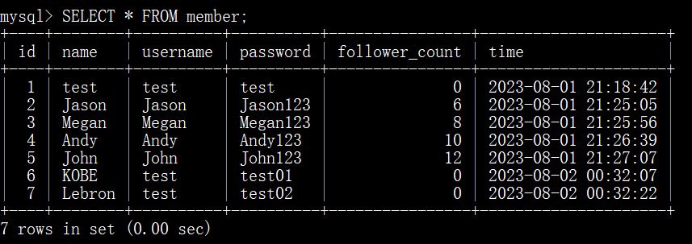
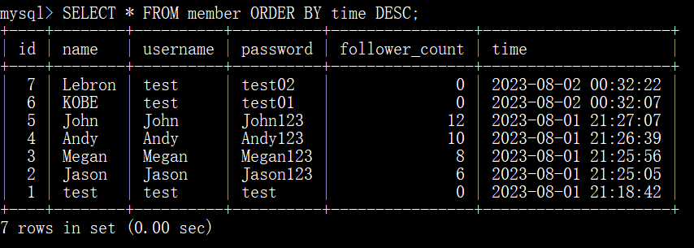
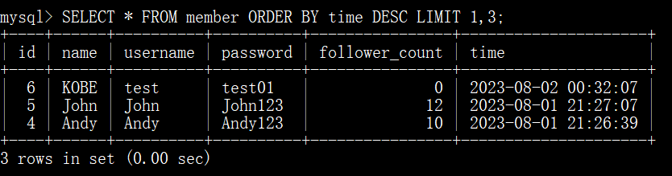
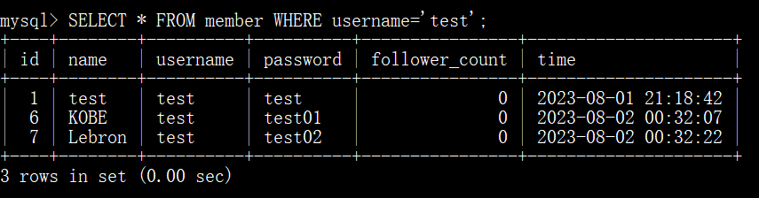
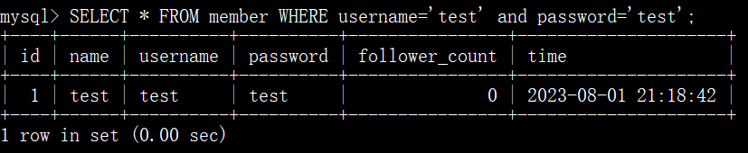
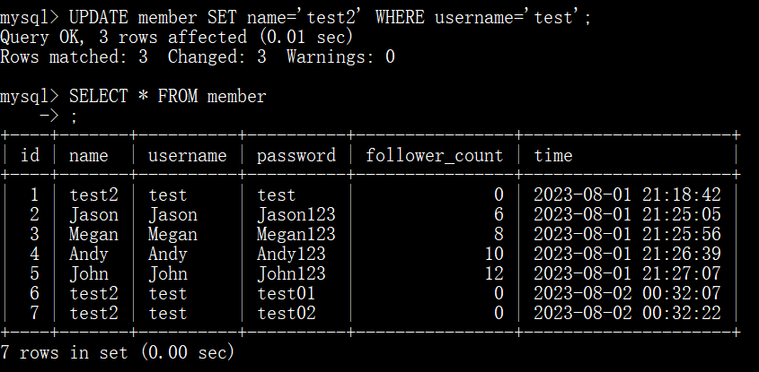

### 要求二: 建立資料庫和資料表
透過終端機 Command Line 介⾯ ，連結到 MySQL 伺服器中進⾏管理，完成以下動作
1. 建立⼀個新的資料庫，取名字為 website 。

  

2. 在資料庫中，建立會員資料表，取名字為 member 。資料表必須包含以下欄位設定：

  | 欄位名稱 | 資料型態 | 額外設定 | 用途說明 |
  | -------- | -------- | -------- | --------|
  | id | bigint  | 主鍵、自動選擇  | 獨立編號 |
  | name | varchar(255)  | 不可為空值  | 姓名 |
  | username | varchar(255)  | 不可為空值  | 帳戶名稱 |
  | password  | varchar(255)  | 不可為空值  | 帳戶密碼 |
  | follower_count  | int unsigned  | 不可為空值，預設為 0  | 追蹤者數量 |
  | time  | datetime  | 不可為空值，預設為當前時間  | 註冊時間 |

  
  
  
---

### 要求三: SQL CRUD
利⽤要求⼆建立的資料庫和資料表，寫出能夠滿⾜以下要求的 SQL 指令：

- 使⽤ INSERT 指令新增⼀筆資料到 member 資料表中，這筆資料的 username 和 password 欄位必須是 test。

  

  接著繼續新增⾄少 4 筆隨意的資料。

  

  

- 使⽤ SELECT 指令取得所有在 member 資料表中的會員資料。

  

- 使⽤ SELECT 指令取得所有在 member 資料表中的會員資料，並按照 time 欄位，由 近到遠排序。

  

- 使⽤ SELECT 指令取得 member 資料表中第 2 到第 4 筆共三筆資料，並按照 time 欄 位，由近到遠排序。 ( 並非編號 2、3、4 的資料，⽽是排序後的第 2 ~ 4 筆資料 )

   

- 使⽤ SELECT 指令取得欄位 username 是 test 的會員資料。

  

- 使⽤ SELECT 指令取得欄位 username 是 test、且欄位 password 也是 test 的資料。

  

- 使⽤ UPDATE 指令更新欄位 username 是 test 的會員資料，將資料中的 name 欄位改 成 test2。

  

---

  
