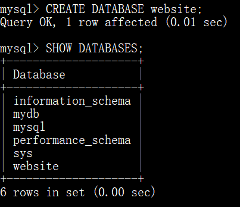
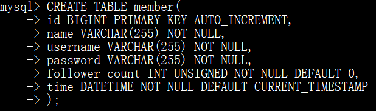
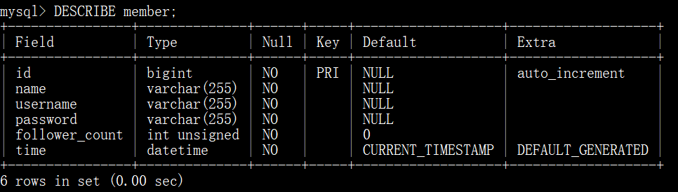

### 要求二: 建立資料庫和資料表
透過終端機 Command Line 介⾯ ，連結到 MySQL 伺服器中進⾏管理，完成以下動作
1. 建立⼀個新的資料庫，取名字為 website 。

  

2. 在資料庫中，建立會員資料表，取名字為 member 。資料表必須包含以下欄位設定：

  | 欄位名稱 | 資料型態 | 額外設定 | 用途說明 |
  | -------- | -------- | -------- | --------|
  | id | bigint  | 主鍵、自動選擇  | 獨立編號 |
  | name | varchar(255)  | 不可為空值  | 姓名 |
  | username | varchar(255)  | 不可為空值  | 帳戶名稱 |
  | password  | varchar(255)  | 不可為空值  | 帳戶密碼 |
  | follower_count  | int unsigned  | 不可為空值，預設為 0  | 追蹤者數量 |
  | time  | datetime  | 不可為空值，預設為當前時間  | 註冊時間 |

  
  
  
